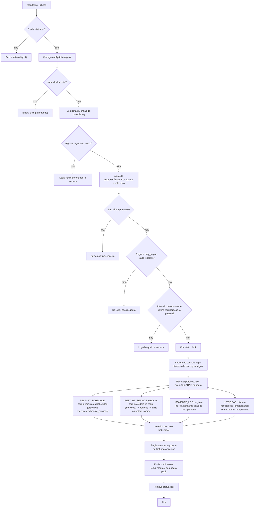

# WatchDog DBAccess

Aplicação de monitoramento automático do ambiente TOTVS Protheus, com foco em
alta disponibilidade e recuperação automática do DBAccess e dos serviços
Schedule.

## Visão geral

O WatchDog é pensado para rodar de tempos em tempos (via Agendador de
Tarefas do Windows), ler o `console.log`, decidir se há um erro conhecido e,
se houver, executar a recuperação automaticamente.

## Como usar

### Flags disponíveis

| Flag | Recebe valor? | O que faz |
|---|---|---|
| `--check` | não | Executa um único ciclo de verificação: lê o log, procura erro, confirma e recupera se necessário. É o padrão (comportamento do Agendador de Tarefas). |
| `--restart` | não | Força uma recuperação completa manual (`RESTART_COMPLETO`), ignorando o motor de regras e a leitura do log. |
| `--status` | não | Exibe o status atual (lock, serviços, últimas recuperações) sem executar nenhuma ação. |
| `--test-rule` | sim (`RULE_ID`) | Simula a detecção de uma regra específica do `config.ini`, sem depender do erro acontecer de verdade no log. |
| `--execute` | não | Usado junto com `--test-rule` para executar a ação de recuperação de fato (ignora `simulate_mode`). Sem essa flag, `--test-rule` só simula. |
| `--config` | sim (`PATH`) | Usa um `config.ini` em um caminho customizado, em vez do padrão (mesma pasta do script/`.exe`). |

`--check`, `--restart`, `--status` e `--test-rule` são mutuamente exclusivos
(só um por execução). `--execute` e `--config` podem ser combinados com
qualquer um deles.

### 1. Configurar

Edite [config.ini](config.ini):

- `monitor.console_log_path`: caminho real do `console.log`.
- `services.dbaccess_service` e `services.schedule_services`: nomes exatos
  dos serviços Windows.
- `[rule:*]`: ajuste ou crie regras (regex, severidade, ação, notificações).
- `[smtp]` / `[teams]`: credenciais reais, se quiser notificações.
- `general.simulate_mode = true`: use isso enquanto estiver testando, para
  não mexer nos serviços de verdade.

### 2. Rodar manualmente (PowerShell como Administrador)

```powershell
cd C:\Workspace\schecule-rebooter\watchdog-dbaccess

# Ciclo único de verificação (o que o Agendador vai chamar)
python monitor.py --check

# Ver status atual (lock, serviços, últimas recuperações)
python monitor.py --status

# Forçar uma recuperação completa manual
python monitor.py --restart

# Testar uma regra específica sem esperar o erro acontecer de verdade
python monitor.py --test-rule dbaccess_connection_lost
python monitor.py --test-rule dbaccess_connection_lost --execute   # executa de fato (ignora simulate_mode)
```

### 3. Gerar o executável

```powershell
python -m PyInstaller WatchDogProtheus.spec
```

Isso gera `dist\WatchDogProtheus.exe`. Copie o `.exe` para a pasta onde ele
vai rodar (ex.: `watchdog-dbaccess\` na raiz) e coloque o `config.ini` **na
mesma pasta do `.exe`** — o PyInstaller não empacota o `config.ini` junto, e
o executável resolve o caminho de configuração a partir da pasta onde o
`.exe` está (não da pasta onde foi gerado).

### 4. Rodar o executável (equivalente ao `python monitor.py`)

O `.exe` aceita exatamente os mesmos parâmetros do script Python:

```powershell
cd C:\Workspace\schecule-rebooter\watchdog-dbaccess

.\WatchDogProtheus.exe --check
.\WatchDogProtheus.exe --status
.\WatchDogProtheus.exe --restart
.\WatchDogProtheus.exe --test-rule dbaccess_connection_lost
.\WatchDogProtheus.exe --test-rule dbaccess_connection_lost --execute
```

Pontos importantes sobre o `.exe`:

- **Pede elevação (UAC) automaticamente.** O spec define `uac_admin=True`,
  então o Windows sempre vai pedir "Sim" no UAC ao rodar o `.exe`, mesmo que
  o terminal já esteja aberto como usuário comum. Não é necessário (nem
  recomendado) já abrir o PowerShell como Administrador antes de chamá-lo.
- **Não abre janela/console.** O build de produção usa `console=False`
  (`WatchDogProtheus.spec`), ou seja, ele roda "invisível" — sem imprimir
  nada na tela, com sucesso ou erro. Isso é esperado: todo o resultado real
  fica em [logs/watchdog.log](logs/) e em `status/history.csv`. Depois de
  rodar, confira sempre esses arquivos para saber o que aconteceu.
- **Se nada for gravado no log após rodar**, o problema é anterior à
  inicialização (ex.: erro de configuração, regra inválida em `config.ini`,
  import quebrado). Para diagnosticar, edite `WatchDogProtheus.spec`
  trocando `console=False` para `console=True`, rode
  `python -m PyInstaller WatchDogProtheus.spec` de novo, e execute o `.exe`
  resultante — agora com uma janela de console visível mostrando o erro real
  (traceback). Depois de corrigir, volte `console=True` para `console=False`
  e gere o build final.

### 5. Agendar

No Agendador de Tarefas do Windows, configure a ação para chamar o `.exe`
com `--check`, marque **Run with highest privileges** (evita o prompt de UAC
em execuções automáticas/sem usuário logado), e defina o intervalo (ex.: a
cada 30s/1min). Garanta que `config.ini` esteja na mesma pasta do `.exe`.

## Panorama do código

| Arquivo | Responsabilidade |
|---|---|
| [utils.py](utils.py) | Lê `config.ini`, configura logging rotativo, controla o lock (`status.lock`), grava histórico CSV, controla intervalo mínimo entre recuperações, faz backup/limpeza do log |
| [monitor_log.py](monitor_log.py) | Lê as últimas N linhas do log (`deque`), carrega as regras `[rule:*]` do `config.ini`, testa regex contra as linhas, confirma o erro relendo depois de alguns segundos |
| [services.py](services.py) | Fala com o Windows via `sc.exe` (parar/iniciar/consultar serviço), faz o Health Check (TCP/HTTP) e executa o fluxo completo de recuperação (`RecoveryOrchestrator`) |
| [notifications.py](notifications.py) | Monta e envia e-mail (SMTP) e cartão do Teams (Webhook) |
| [monitor.py](monitor.py) | Ponto de entrada / CLI. Classe `WatchdogApp` amarra tudo: monitor → regras → recuperação → histórico → notificação |

## Fluxo do `--check` (uso principal)



Os comandos `--restart`, `--status` e `--test-rule` reaproveitam essas mesmas
peças (`RecoveryOrchestrator`, `RecoveryHistory`, `NotificationService`), só
entrando no fluxo por um caminho diferente — sem depender de encontrar um
erro no log de verdade.

## Ação `RESTART_SERVICE_GROUP`

Além das ações genéricas (`RESTART_COMPLETO`, `RESTART_DBACCESS`,
`RESTART_SCHEDULE`), uma regra pode definir seu **próprio** grupo de serviços
via a chave `services` (lista separada por vírgula, na ordem de **parada**).
A inicialização é feita automaticamente na ordem inversa.

Isso é útil quando um erro específico (ex.: código 1326 de perda de conexão
com o SQL Server) exige reiniciar uma combinação particular de serviços
(Schedules, REST, Broker, DBAccess Slave etc.) que não corresponde ao fluxo
padrão de `RESTART_COMPLETO`. Veja o exemplo já configurado em
[config.ini](config.ini), na regra `[rule:dbaccess_connection_lost]`.


---

# Executando os Scripts:

```powershell
cd C:\Workspace\schecule-rebooter

# 0. Bypass na permissão
Set-ExecutionPolicy -Scope Process -ExecutionPolicy Bypass

# 1. Cria e inicia os 16 servicos dummy do grupo
.\tests\setup_watchdog_group_services.ps1

# 2. Confirma que estao todos rodando
Get-Service "TOTVS_Schedule_*", "TOTVS_Protheus_*", "00_TOTVS_DBAccess_Slave"

# 3. Dispara a regra de verdade (bypassa a leitura do log, executa a acao real)
python watchdog-dbaccess\monitor.py --test-rule dbaccess_connection_lost --execute

# 3.1 Analise dos logs procurandopelo 1326
python watchdog-dbaccess\monitor.py --check

# 4. Confere o resultado 
Get-Service "TOTVS_Schedule_*", "TOTVS_Protheus_*", "00_TOTVS_DBAccess_Slave"
Get-Content watchdog-dbaccess\status\history.csv
Get-Content watchdog-dbaccess\logs\*.log -Tail 40

# 5. Limpa o ambiente
.\tests\teardown_watchdog_group_services.ps1
```