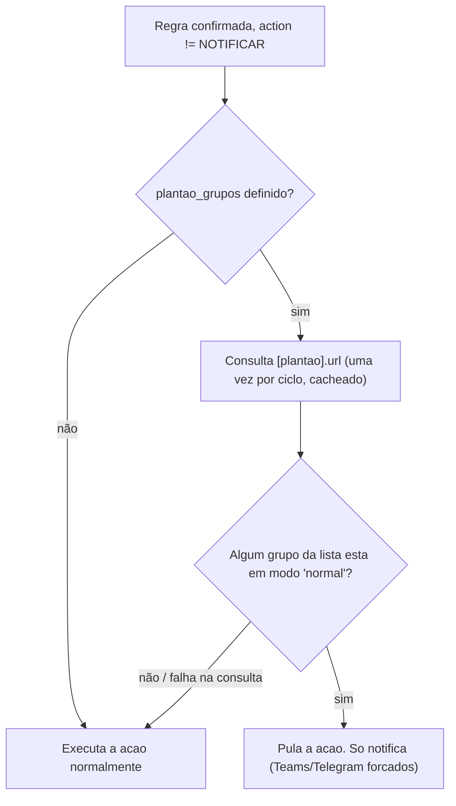
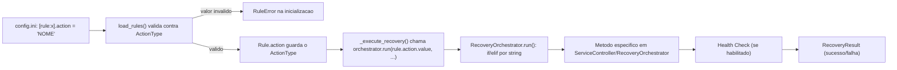

# Ações de recuperação (`action`)

Este documento explica como funcionam as ações de recuperação do WatchDog
DBAccess: onde estão implementadas no código, o que cada uma faz de fato,
como configurá-las no `config.ini` e como adicionar uma ação nova.

## Onde vivem no código

| Peça | Arquivo | Responsabilidade |
|---|---|---|
| `ActionType` (Enum) | [`monitor_log.py`](../monitor_log.py) | Define quais valores de `action` são **aceitos** dentro de uma seção `[rule:*]` do `config.ini`. Se o valor não bater com nenhum membro do enum, `load_rules()` lança `RuleError` e a aplicação nem inicializa. |
| `Rule` (dataclass) | [`monitor_log.py`](../monitor_log.py) | Representa uma regra carregada do `config.ini`, incluindo o campo `action: ActionType`. |
| `ServiceController` | [`services.py`](../services.py) | Encapsula chamadas ao `sc.exe` (start/stop/query de um serviço Windows). |
| `RecoveryOrchestrator.run()` | [`services.py`](../services.py) | **Onde a ação é de fato executada.** Recebe o nome da ação (string) e despacha para o método correspondente (`if/elif` por valor de string, não pelo enum). |
| `WatchdogApp._execute_recovery()` | [`monitor.py`](../monitor.py) | Chama `RecoveryOrchestrator.run(rule.action.value, ...)` quando uma regra é confirmada durante o `--check`. |
| `WatchdogApp.force_restart()` | [`monitor.py`](../monitor.py) | Usado pela flag `--restart` da CLI. Chama `RecoveryOrchestrator.run("RESTART_COMPLETO", ...)` **diretamente, com uma string fixa**, sem passar pelo motor de regras nem pelo `ActionType`. Por isso `RESTART_COMPLETO` continua funcionando via `--restart` mesmo não estando mais disponível como opção de `action` dentro de uma regra (ver observação abaixo).

Importante: `ActionType` (o que uma **regra** pode declarar em `config.ini`) e o
`if/elif` de `RecoveryOrchestrator.run()` (o que o **código** sabe executar)
são duas coisas independentes. Hoje o código em `services.py` ainda sabe
executar `RESTART_COMPLETO` e `RESTART_DBACCESS`, mas esses dois valores
foram removidos do `ActionType` — ou seja, **nenhuma regra pode mais usá-los**,
eles só são alcançáveis via `--restart` (manual, na linha de comando).

## Ações disponíveis para regras (`[rule:*].action`)

| Ação | O que faz | Serviços afetados | Requer chave extra? |
|---|---|---|---|
| `RESTART_SERVICE_GROUP` | Para, na ordem declarada, e depois inicia na ordem inversa, um grupo de serviços **customizado por regra**. Ao final, valida (`validate_services`) que todos voltaram para o estado `RUNNING`. | A lista definida na própria regra, chave `services` | Sim — `services` (obrigatória; lista separada por vírgula, ordem de **parada**) |
| `RESTART_SCHEDULE` | Para todos os serviços Schedule na ordem declarada em `[services].schedule_services` (do maior índice ao Broker) e depois inicia na ordem inversa (Broker primeiro). | A lista **global** `[services].schedule_services` (compartilhada por qualquer regra que use essa ação) | Não |
| `SOMENTE_LOG` | Não executa nenhuma ação de recuperação. Apenas registra no log que a regra foi detectada (a linha `"Acao configurada como SOMENTE_LOG..."`). Respeita `only_log`/`auto_execute` normalmente — ou seja, só chega a notificar se essas flags permitirem. | Nenhum | Não |
| `NOTIFICAR` | Ação dedicada **apenas a notificações** (e-mail/Teams). Nunca tenta nenhuma recuperação e **ignora `only_log`/`auto_execute`** — sempre executa e dispara os canais habilitados na regra (`send_email`/`send_teams`), respeitando somente o intervalo mínimo `min_recovery_interval_seconds` (para não gerar spam). Ideal para erros que não fazem sentido "recuperar" via restart de serviço (ex.: erro de dado, como chave duplicada). O resultado exibido nas notificações é `ALERTA` (não `SUCESSO`/`FALHA`), e o card do Teams usa uma cor/texto neutros em vez do tom de "recuperação concluída". | Nenhum | Não |


## Ações "escondidas" (só via `--restart` manual, não via regra)

| Ação (string interna) | O que faz | Como é acionada |
|---|---|---|
| `RESTART_COMPLETO` | Para todos os Schedules → reinicia o DBAccess → inicia todos os Schedules → valida que **tudo** (DBAccess + Schedules) está `RUNNING`. | Só via `WatchDogProtheus.exe --restart` / `python monitor.py --restart`. Não pode ser usada em `[rule:*].action` (não existe mais no `ActionType`). |
| `RESTART_DBACCESS` | Para e reinicia somente o serviço do DBAccess (`[services].dbaccess_service`). | Código presente em `services.py`, mas **não é acionável hoje** por nenhum caminho (nem regra, nem flag de CLI). Existe como base de implementação caso um dia se queira expor essa opção. |

## Como configurar no `config.ini`

```ini
[rule:minha_regra]
description = Texto livre exibido em logs e notificacoes
pattern = (?i)algum regex aqui
severity = ALTA
action = RESTART_SCHEDULE
send_email = true
send_teams = false
send_telegram = false
only_log = false
auto_execute = true

; Obrigatorio apenas quando action = RESTART_SERVICE_GROUP
services =
    Servico_A,
    Servico_B,
    Servico_C

; Opcional: associa a regra a um ou mais grupos de atendimento (ver secao
; "Modo de operacao (Plantao)" abaixo). Se omitido, a regra nunca e afetada.
plantao_grupos = 2, 3
```

Campos que interagem com a ação escolhida:

- `only_log = true` força a regra a **apenas logar**, independente do valor de `action` (nunca chega a chamar `RecoveryOrchestrator.run()`) — **exceto** quando `action = NOTIFICAR`, que ignora essa flag (ver acima).
- `auto_execute = false` faz a regra ser detectada e logada, mas a ação **não é executada de fato** (fica só sugerida no log) — **exceto** quando `action = NOTIFICAR`, que sempre executa (só a notificação, nunca uma recuperação real).
- `general.simulate_mode = true` (seção `[general]`) faz **qualquer** ação apenas simular (loga "[SIMULACAO] Acao 'X' nao sera executada de fato") sem mexer em nenhum serviço — vale para todas as regras, é um interruptor global.
- `plantao_grupos = <ids separados por virgula>` faz a regra ser **gated** pelo modo de operação de um ou mais grupos de atendimento — ver seção [Modo de operação (Plantão)](#modo-de-operação-plantão) abaixo. Não se aplica a `NOTIFICAR` (que já nunca executa recuperação).

## Modo de operação (Plantão)

Além de `only_log`/`auto_execute`/`simulate_mode`, uma regra pode ser "gated"
por um recurso adicional: o **modo de operação** de um ou mais grupos de
atendimento, consultado em tempo real via HTTP antes de executar a
recuperação.

**Onde vive no código:** `PlantaoChecker` em [`services.py`](../services.py),
instanciado como `self.plantao_checker` em `WatchdogApp.__init__`
([`monitor.py`](../monitor.py)) e consultado dentro de `_execute_recovery()`.

**Configuração (`[plantao]` no `config.ini`):**

```ini
[plantao]
enabled = true
url = https://tars.buddemeyer.com.br/plantao/ws/ws_verificaPlantao.php
timeout_seconds = 10
```

O endpoint é chamado **uma única vez por ciclo de verificação** (o resultado
é cacheado em memória por `PlantaoChecker`) e deve retornar o modo de
operação de **todos** os grupos de atendimento numa única resposta:

```json
{"status": "ok", "message": "...", "grupos": {"1": "normal", "2": "Plantao", "3": "Plantao"}}
```

Cada regra declara, opcionalmente, a chave `plantao_grupos` (lista de ids
separados por vírgula) informando quais grupos são responsáveis por ela:

```ini
[rule:dbaccess_connection_lost]
...
action = RESTART_SERVICE_GROUP
plantao_grupos = 2, 3
```

**Lógica (`PlantaoChecker.is_normal_mode(grupos)`):**

- Regra **sem** `plantao_grupos` (lista vazia) → sempre retorna `False`. A
  regra nunca é afetada; segue exatamente o comportamento configurado em
  `only_log`/`auto_execute`.
- Regra **com** `plantao_grupos` → se **qualquer** grupo da lista estiver em
  modo `"normal"` na resposta do endpoint, retorna `True`: há técnico
  presente de pelo menos um dos times responsáveis, então a recuperação
  automática é **pulada** e a ocorrência é apenas **notificada** (Teams e
  Telegram são forçados a `true` nesse caso, mesmo que a regra não os tenha
  habilitado, pois é o único jeito de avisar o técnico presente).
- Só quando **todos** os grupos da lista estiverem em modo `"Plantao"`
  (ninguém presencial em nenhum deles) a recuperação automática roda
  normalmente, com as notificações respeitando as flags normais da regra
  (`send_email`/`send_teams`/`send_telegram`).
- Falha ao consultar o endpoint (timeout, erro de rede, resposta inválida),
  `[plantao].enabled = false`, ou grupo ausente na resposta → assume-se o
  lado seguro ("Plantao"): a recuperação automática **não é bloqueada**.



## Notificações detalhadas de recuperação

Sempre que uma recuperação automática **de verdade** é executada (ação
`RESTART_SCHEDULE` ou `RESTART_SERVICE_GROUP`, fora do modo `normal` do
Plantão), `_execute_recovery()` (em [monitor.py](../monitor.py)) força o
envio da notificação por Teams e Telegram, mesmo que a regra tenha
`send_teams`/`send_telegram` desabilitados:

```python
executed_auto_recovery = not skip_for_normal_mode and rule.action in (
    ActionType.RESTART_SCHEDULE,
    ActionType.RESTART_SERVICE_GROUP,
)
...
self.notifications.notify(
    payload,
    rule.send_email,
    rule.send_teams or skip_for_normal_mode or executed_auto_recovery,
    rule.send_telegram or skip_for_normal_mode or executed_auto_recovery,
)
```

Isso fecha uma lacuna: regras críticas (como `dbaccess_connection_lost`) que
têm `send_teams = false`/sem `send_telegram` no `config.ini` (pensadas para
não gerar ruído no dia a dia) agora avisam o time de plantão sempre que uma
recuperação automática de verdade acontece.

O detalhamento por serviço é rastreado em `RecoveryOrchestrator` via
`ServiceStepResult` (`service`, `operation` — `"parar"`/`"iniciar"` —,
`success`, `error`), acumulado em `RecoveryResult.steps` e repassado para
`NotificationPayload.steps`. Isso preserva o comportamento fail-fast já
existente (a recuperação aborta na primeira falha de serviço), mas agora
mantém um registro de quais serviços já haviam sido processados até esse
ponto.

`NotificationPayload.format_steps()` monta a lista ordenada de serviços
(reaproveitada por e-mail, Teams e Telegram) e `status_final()` monta o
texto do status consolidado. A mensagem final inclui:

- Data/hora, ambiente e servidor (hostname).
- Erro identificado e ação executada.
- Lista ordenada dos serviços afetados, cada um com ✅ (sucesso) ou ❌ (falha).
- Tempo total de recuperação.
- Status final consolidado.

Legenda de emojis:

| Emoji | Categoria | Significado |
|---|---|---|
| ✅ | Sucesso | Operação/recuperação concluída com sucesso |
| ❌ | Erro | Operação/recuperação falhou |
| 🔔 | Alerta | Nenhuma recuperação automática foi executada (modo `normal` do Plantão ou ação `NOTIFICAR`) |

## Como criar uma ação nova

1. **Adicionar o valor ao enum** em [`monitor_log.py`](../monitor_log.py), dentro de `class ActionType`:
   ```python
   class ActionType(Enum):
       ...
       MINHA_ACAO_NOVA = "MINHA_ACAO_NOVA"
   ```
2. **Implementar o comportamento** em `RecoveryOrchestrator.run()` (`services.py`), adicionando um novo `elif`:
   ```python
   elif action == "MINHA_ACAO_NOVA":
       ...  # sua logica aqui, usando self.controller / self.config
   ```
3. **Documentar no comentário do `config.ini`** (bloco acima de `[rule:dbaccess_connection_lost]`) a nova opção válida para `action`.
4. **Atualizar a tabela acima** neste documento.
5. **Testar** com `python monitor.py --test-rule <id> --execute` (ou o `.exe` equivalente) antes de usar em produção.

## Referência rápida — fluxo de execução de uma regra


